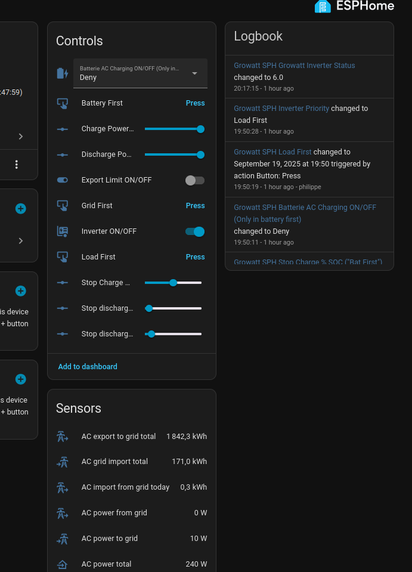

# esphome-growatt-sph
Esphome definitions for Growatt Wifi-X stick with SPH1000-TL3-BH-UP

This is a simple yaml to flash the Growatt Wifi-X stick with esphome to replace 
the slowly updating cloud so you are actually able to use Home Assistant.

As I needed to do a lot of digging and could not find a working one for my SPH I hope
you will find this works for you if you find yourself in my situation.

This has most sensors added and working, you can switch between battery, grid or load First and enable AC charging.
Setting (dis)charging limits is also possible.

With adjusted uart ports this probably will also work with a serial converter and
regular esp32 connected on one of the RS485 ports.

